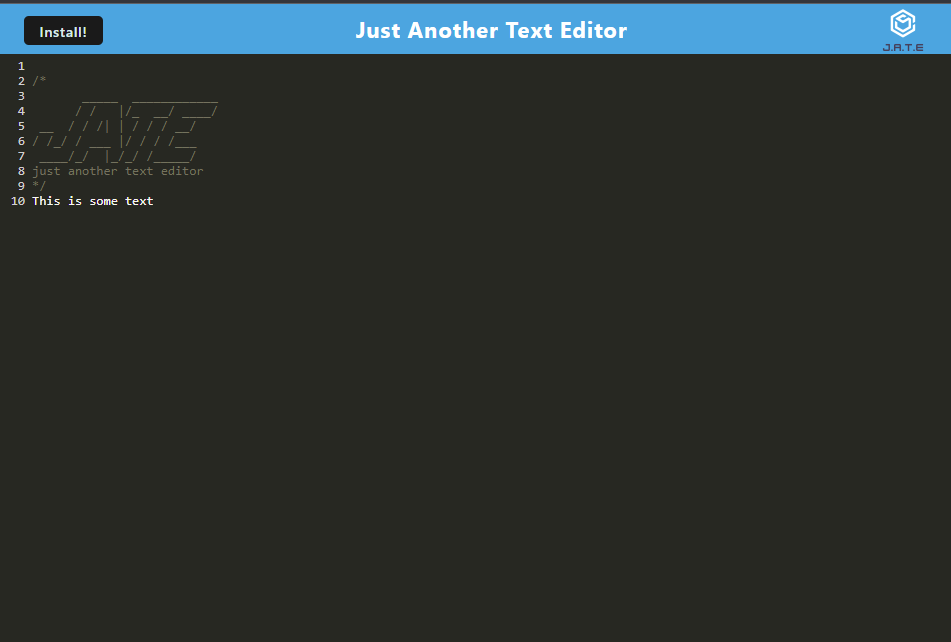
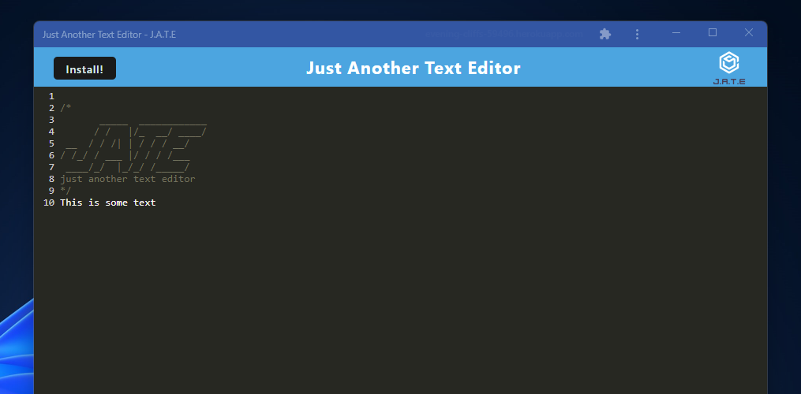

# Text Editor

## Description

This project is a PWA text editor designed for you to use on a website. This website will allow you to write down text and it will be saved into indexDB on your local machine. This also has a service worker that will allow you to still work with this PWA offline. It also has an install button, so that you may install this web app onto your machine and use it from there. 

## Table of Contents

* [Technologies](#technologies)
* [Installation](#installation)
* [Usage](#usage)
* [Questions](#questions)
* [License](#license)

## Technologies

| Technology | Link |
| -------- | ------|
| HTML |   |
| Javascript |    |
| Node.js | https://nodejs.org/en/ |
| npm | https://www.npmjs.com/ |
| express | https://expressjs.com/ |
| indexedDB |   |
| webpack | https://webpack.js.org/ |
| workbox | https://developers.google.com/web/tools/workbox |
| babel | https://babeljs.io/ |

## Installation

After cloning the repository run an npm install in the root directory. This will install all the node modules needed to run this web app in the root directory and the client directory. From there type in npm start to build the web app and run the server.

## Usage

Upon loading into the webpage a text editor will be displayed on screen, type in anything you want into this text editor and it will be saved locally. Here is what the text editor looks like:  

  

This project will run offline, so if you have no internet after initially loading the page it will work just fine. It is also downloadable as well. Just click the install button and a prompt will come up asking if you want to install. From there it will be installed as a chrome application. This is what it looks like after downloaded:  

  

## Questions
If you have any questions you can reach me at:  
Github: cmwschroeder  
Github link: https://github.com/cmwschroeder  
Email: cmwschroeder@gmail.com

## License

Licensed under the [MIT License](LICENSE)